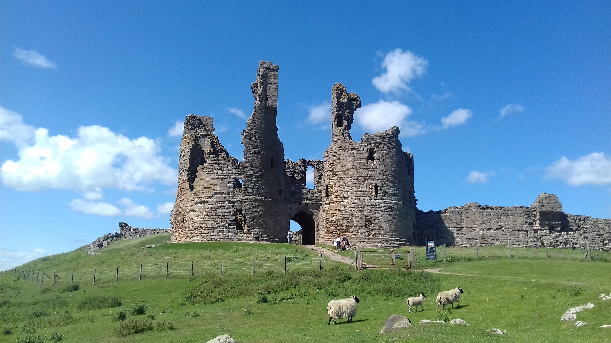

## Assessment 1 - Agent-based modelling

Assessment 1 brief: <a href="https://www.geog.leeds.ac.uk/courses/computing/study/core-python/assessment1/index.html" target="_blank"> GEOG5990M Programming for Spatial Analysts website </a>.

### Model Code and Description
* Assessment 1 (30%) is an online portfolio of an agent-based model. The model code is stored in <a href="https://github.com/gy19rgm/GEOG5990Assessment1" target="_blank"> *GEOG5990 Assessment 1 repository* </a>, along with relevant README, licensing and documentation files.
* In the model, sheep and sheepdogs interact within a field environment, eating, sharing grass and running as they go. The model runs as an animation hosted on a Graphical User Interface (GUI) - this allows the user to choose the quantity of sheep and sheepdogs to be used in the model. Neither sheep or sheepdogs can leave the environment, both are penned in by the field 'fence'.
* The model continues until a. total number of iterations are reached or, b. a sheep has eaten too much grass that it's personal store has reached a pre-determined capacity. 

* | Number of sheep | Number of dogs |
| :---: | :---: |
| Between 50 - 100 | Between 5 - 10 |

##### Screen capture showing the GUI and a still from an example animation 

### Agent information
#### Sheep:
* Move in a random direction, eating grass and sharing their collected grass resources with neighbouring sheep
* If a sheep notices a dog it moves in the opposite direction twice as fast as normal

#### Sheepdogs:
* Dogs move in a random direction at a faster speed to the sheep
* If a dog notices a sheep it halves the distance between itself and the sheep - replicating a 'sprint' and 'stalk'  motion

##### Sheep in front of Dunstanburgh Castle, England. Source: Own photo

[*Back to homepage*](https://gy19rgm.github.io/) / [*Assessment 2*](https://gy19rgm.github.io/Assessment2)