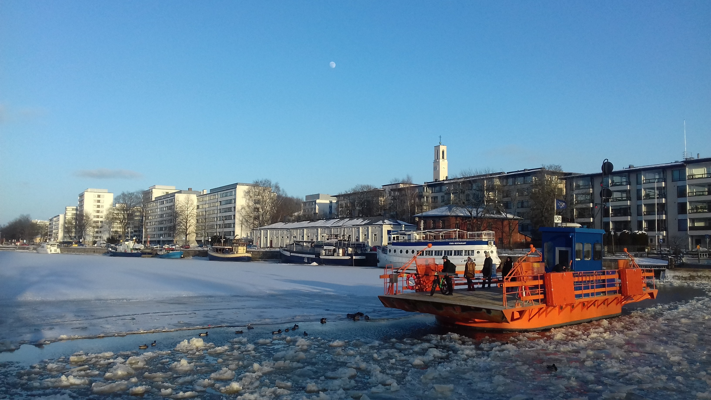

###### Pedestrian Ferry - Föli, Finland

This website was created to be an online portfolio of the **GEOG5990 Module**, which is a component of the UoL MSc GIS.

More information about myself can be found [here](https://gy19rgm.github.io/profile), while my wordpress site can be found at <a href="https://rosieresearches.wordpress.com/" target="_blank"> Rosie Researches </a> .

### GEOG5990 Assessment Information

At present, this site explains and provides links to [Assessment 1](https://gy19rgm.github.io/Assessment1) and [Assessment 2](https://gy19rgm.github.io/Assessment2) material for GEOG5990.
