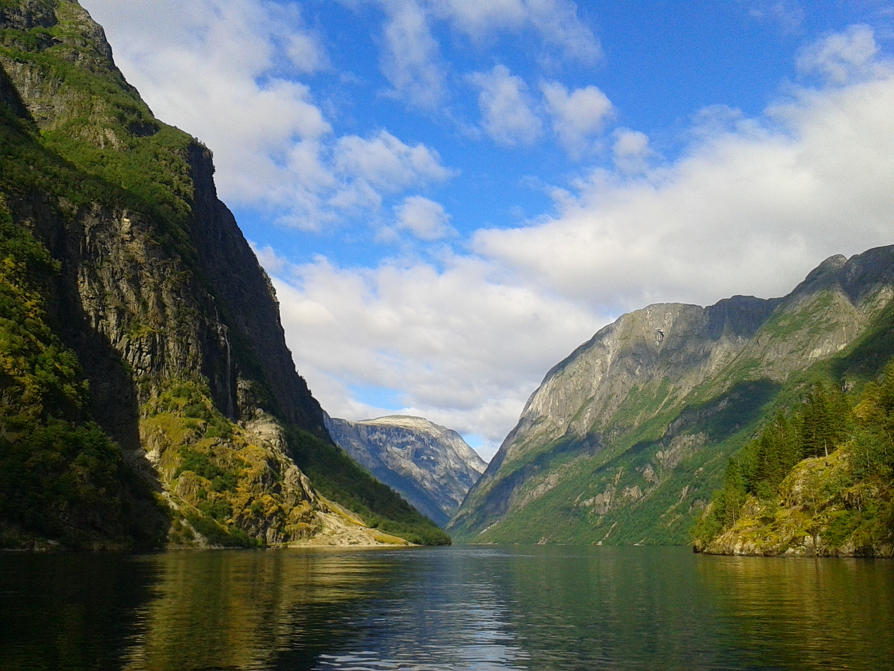

#### I'm a GIS MSc student student at the University of Leeds.

###### The Norwegian Fjord Nærøyfjord 

Growing up in the south of England I was brought up with a love for geography and travel. I graduated from the University of Sheffield, including studying for one year at Turun Yliopisto (Finland), before moving to Leeds to complete a MSc in GIS.

My interest in GIS really took off during my time at Turun Yliopisto, and was developed further throughout my undergraduate disseration. It is my hope that my current MSc degree will be the perfect stepping stone to advancing my interests in GIS and to a fufilling and interesting career upon graduation.

[*Back to main page*](https://gy19rgm.github.io/)