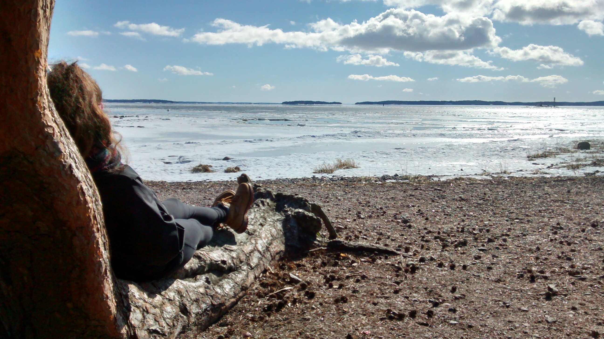

#### I'm a GIS MSc student student at the University of Leeds.

Having grown up in the south of England I graduated from the University of Sheffield before moving to Leeds for an MSc in GIS.
In addition, I also studied for one academic year at Turun Yliopisto

My interest in GIS took off during my time at Turun Yliopisto, and was developed throughout my undergraduate disseration. It is my hope that my current MSc degree will be the perfect stepping stone to advancing my interests in GIS and to to a fufilling and interesting career upon graduation.

<a href="https://gy19rgm.github.io/" target="_blank"> *Back to main page* </a>